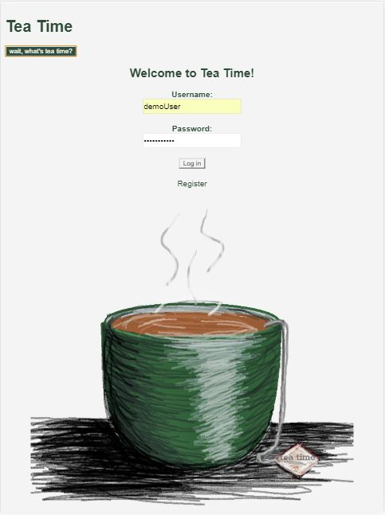
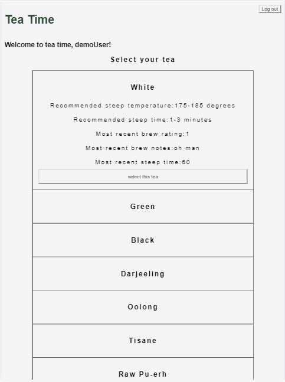
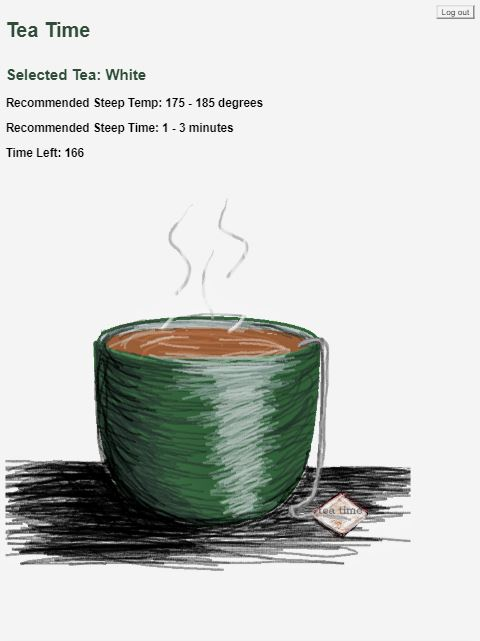
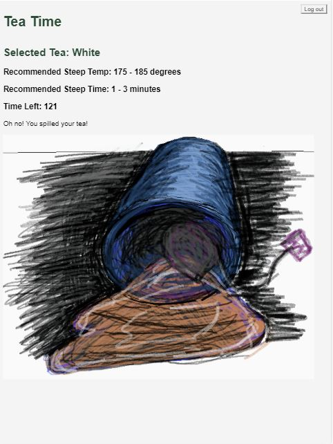
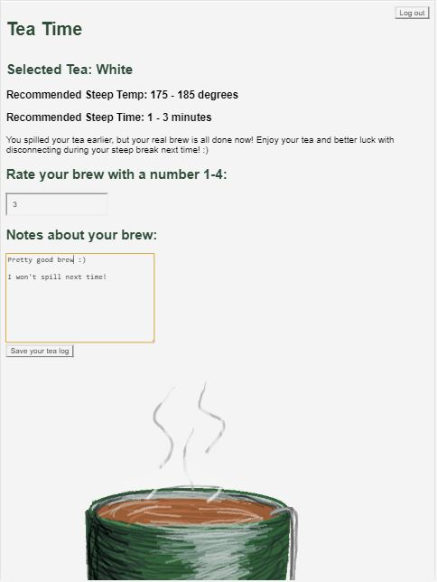

# tea-time-client-jsantiag

This project was bootstrapped with Create React App.

## Tea-Time :tea:
Tea-time is a tool for tea drinkers to perfect their brew of choice whilst practicing mindfulness and 
impulse control. 

Average tea steep times range from 2-4 minutes, those 2 - 4 minutes are a great time for a mental break. 

While your tea-time steep countdown is running your sole objective is to disconnect from your screen and 
the many tasks that may be cluttering your headspace. 

If you leave the tea-time page before your countdown reaches zero your virtual cup 
will spill over  :disappointed:

Try not to spill your tea and reap the benefits of disengaging for a few minutes each day 
while getting ever closer to your perfect brew.

<a href="https://tea-time-client.herokuapp.com">Tea-Time live link hosted on Heroku</a>

## Previews:

##### landing page 

##### tea-list 

##### timer page

##### spill view

##### tea review  

## Tech Stack: 

React and Redux for state management on the frontend

MongoDb for backend data management 
-notes, ratings, custom tea creation, and user selection tracking

JWT authentication is used for protecting all user data :closed_lock_with_key:

Tea-Time uses React Page Visibility, a sweet NPM library that powers its spill tracking feature

### Core Dependencies: 
    - "jwt-decode": "^2.2.0",
    - "pretty-ms": "^4.0.0",
    - "react": "^16.6.3",
    - "react-dom": "^16.6.3",
    - "react-page-visibility": "^3.0.0",
    - "react-redux": "^5.1.1",
    - "react-router-dom": "^4.3.1",
    - "react-scripts": "2.1.1",
    - "redux": "^4.0.1",
    - "redux-form": "^7.4.2",
    - "redux-thunk": "^2.3.0"

### Main components: 

- landing-page.js 
holds login-form, register link, and info popup feature
- tea-list.js
holds pre-loaded list of teas and custom tea creator form 
- tea-timer.js 
holds timer functionality and tea log review form

